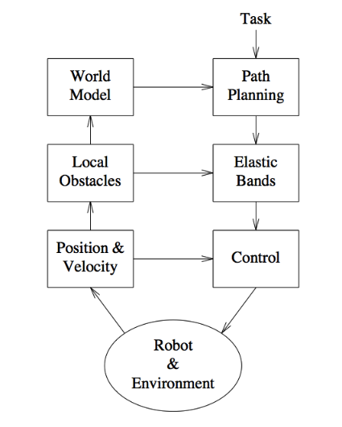

!SLIDE light-on-dark center bgfull

# Elastic Bands #
### _- and Potential Fields - Quinlan and Khatib -_

####  P. Strong

!SLIDE center framework

# Navigation Framework

.notes - So far we have seen global planners, but now we swill see a local planner.
- The planner takes environmental data ( obstacles, position, velocity) and current global path and outputs control values
- A closed control loop
- FOR THIS PAPER WE WILL ONLY be viewing the planning, not the control.
- FIRST, we will go over POTENTIAL FIELDS as an intro to elastic bands.