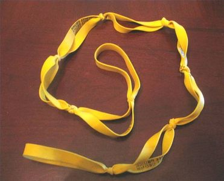
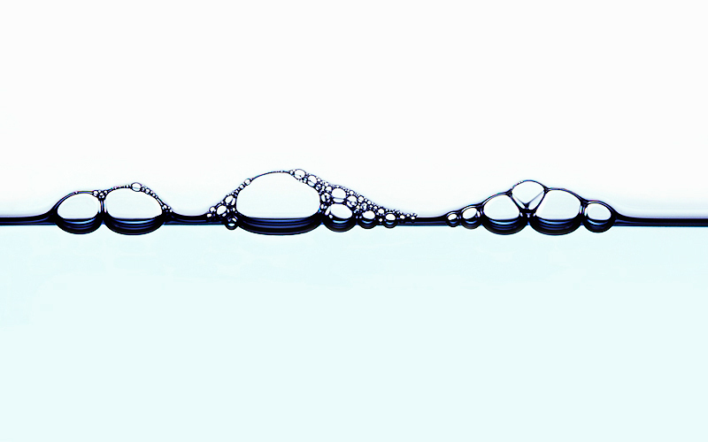
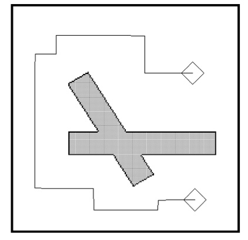
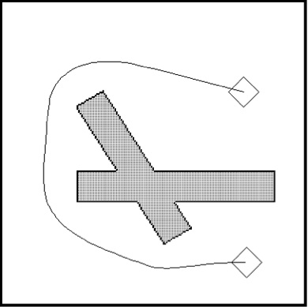
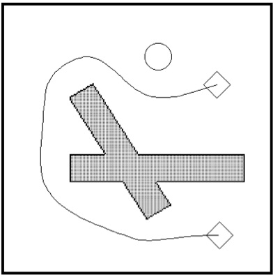

!SLIDE eband incremental center

# What is this deformable collision-free path?

- 

!SLIDE bgfull center transition=uncover

!SLIDE light-on-dark incremental transition=fadeZoom

# ... and it is also the __global path__

!SLIDE light-on-dark incremental center

# ... and it is also the __global path__

### (initially)

!SLIDE center

# A* Global Plan (or similar)

.notes Like a typical A* plan the corners are sharp and not optimal at the control-level, but doesn't matter. 

!SLIDE incremental

# Improvements to Path (local planning)
- Optimize the path, smoothing it out
- ... while avoiding obstacles  
- How do we achieve this?

.notes IN order to achieve this...

!SLIDE

## This is where Elastic Bands borrows from Potential Fields.

!SLIDE center incremental

# Similarites to Potential Fields
- We continue to have imaginary forces being applied to the system, and obstacles exert a repelling force.

# Key differences
-  We now have a complete free path directly to the goal. Which means we no longer need an attractive force directed towards the goal.
- All imaginary forces are applied to the __path__ itself, not the _robot_!

!SLIDE

# A* Plan (now an elastic band)

### But now let's apply imaginary forces to the band to improve it

.notes We have now converted the global plan to an elastic band.

!SLIDE transition=fade

### First, we apply a _Internal Contraction/Tension Force_ to smooth the path

!SLIDE transition=fade

### Finally, we apply an _External Repulsive Force_ to repel the elastic band from any obstacles

!SLIDE incremental center

# And that is the Elastic Band Method.

- Elastic Bands are able to successfully deform the path for small changes and avoid obstacles while maintaining the original path form. 
- Of course closing a door, or complete disconnect in the path would require global planning to be run again.