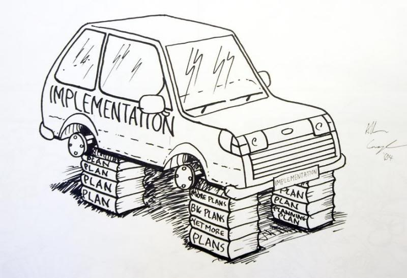
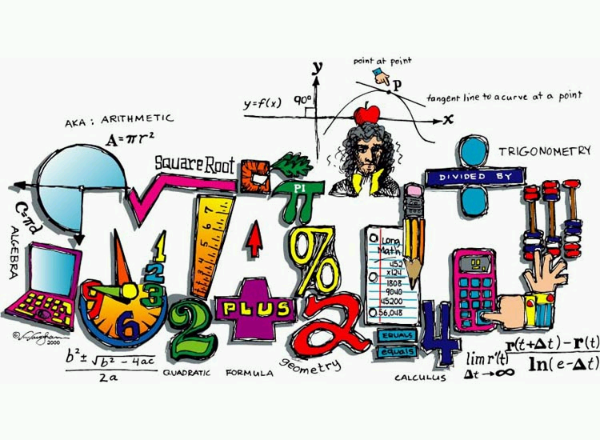

!SLIDE 

  
  
  
!SLIDE incremental center

## Complexities w/ Collision Detection
- Elastic bands are similar to "snakes" from computer vision.
  - but there is key difference (example)
- However, The Elastic Band must represent a collision free path for the ROBOT, not just the band itself. The Robot has bigger footprint than the elastic band(snake) itself.
- In order to determine whether a curve is collision free we must examine the configuration space of the robot and calculate the free space. The free space of robot is the subset of the c-space in which the robot does not touch any obstacles.
- Additionally, performing collision detection on curves is more complex than with lines.

.notes - Draw snake example after first point.
- Explain why free space is computationally expensive to generate and represent. The robot can be a complex 3d manifold with joints and other moving parts.
- Second complexity, we have to check curves rather than line 
