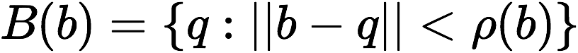
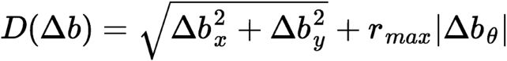
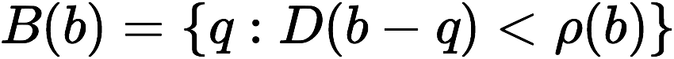

!SLIDE bgfull light-on-dark
  

# Why Bubbles?

.notes - Because our current problem (free space) is difficult. Collision.  Especially in high dimensionality c-space.

!SLIDE center

# A Bubble

    "The bubble concept offers an efficient method of
    maintaining a collision-free path even in high 
    dimensional c-spaces. Instead of trying to compute 
    and represent the entire free space, we use a model 
    of an environment and robot to generate, on the fly, 
    local subsets of the free space. Each subset, called 
    a bubble, is computed by examining the local freedom 
    of the robot at a given configuration."
    
!SLIDE transition=fade center incremental

# A Bubble

- is a Circle at its simplest, and its size/radius is simply determined by computing the distance from its center to the nearest obstacle.
- This means, from the center of the bubble we can move ρ (rho) distance in ANY direction and be safe from collision.
- In other words, anywhere inside of the bubble is free space, the bubble is a subset of the full free space. And "We have now reduced the free space to a one dimensional manifold in the higher dimensional c-space."
- Therefore, both the robot and path are free in any bubble.

.notes - Draw this again / bubbles
- Now instead of having to calculate all the possible c-spaces in the system
    
!SLIDE

!SLIDE longtext center incremental

# Elastic Band / Bubble Path

* We know that bubbles are free space, so if they overlap then we know there is a free trajectory through them. Therefore, we impose a condition that the bubbles most always overlap their neighbors. If at any point this does not become possible, then the elastic band has “snapped”.
* Essentially, any path that passes exclusively through the bubbles is a collision-free path. As long as we maintain and construct a series of overlapping free-space bubbles from origin to goal, we know we have a collision-free path. We can maintain this path by removing and inserting bubbles as needed.

.notes - Again, draw overlapping bubbles to demonstrate free space
- Draw a multitude of paths that successfully pass through bubbles
- Some talk about using minimum strain energy splines to construct a smooth path through the bubbles.

!SLIDE longtext center

# Higher Dimensions

* The dimensionality does not affect the definition of the bubble. It only affect the calculation of the magnitude of change. As before, the bubble is defined as any configuration q where the magnitude of the difference to the origin is less than the distance to an obstacle.

!SLIDE

# Tradeoffs of Bubbles

.notes Obviously, bubbles are a coarse representation of the free space around the robot. There’s a possibility of using ellipses or other shapes, but this increases the complexity of bubble computation. Essentially, not explored.