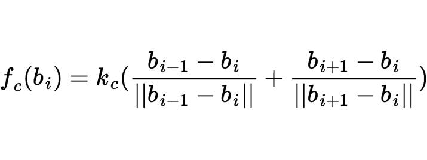
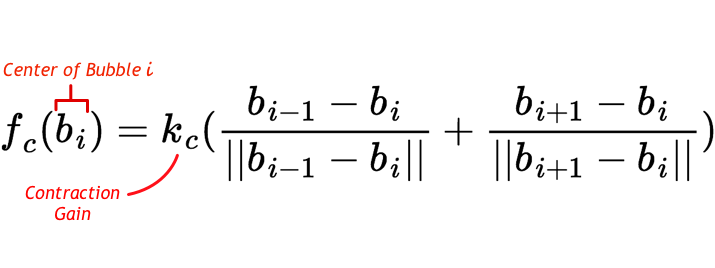
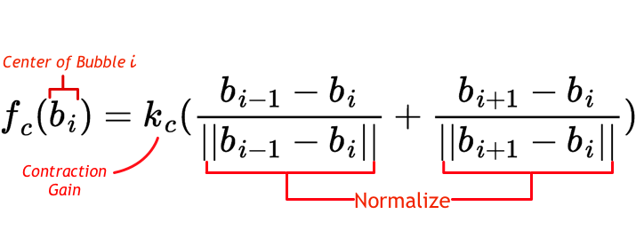
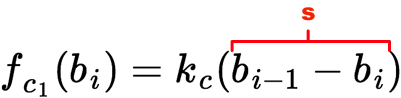
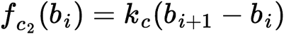

!SLIDE force-slide subsection

# Internal Contraction Force Equation

!SLIDE force-slide subsection transition=fade

# Internal Contraction Force Equation

!SLIDE force-slide subsection incremental longtext transition=slideY

# Internal Contraction Force Equation

- It represents a series of springs of uniform tension between the bubbles 
- We normalize the tension because we only care about removing slack

.notes it represents a series of springs between the bubbles uniform tension
If time, create vector diagram of forces.
The force from each spring is normalized to reflrect uniform tension. The distance doesn’t matter, just direction. If the distance is larger then one of the bubbles is larger as well.

  
  

