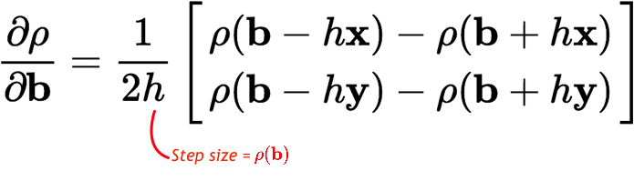

!SLIDE force-slide smalltxt subsection

# Repulsive Force Equation

"The repulsive force pushes the bubbles away from the obstacles to increase the clearance of the robot."

### "The size of a bubble gives an indication of how far the robot is from collision so we define the repulsive force such that it increases this size"

.notes The proportional modifier is not used in the implementation - marked TODO

!SLIDE force-slide subsection transition=slideY

# Repulsive Force Equation

.notes In summary, it is a downhill gradient search

!SLIDE center nobullet incremental

# Update bubble positions

- 

- 

- <h3>Which basically means large bubbles will move more than small bubbles</h3>