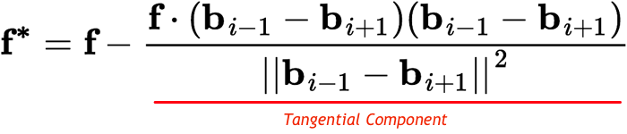
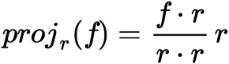

!SLIDE

# How do we solve bubble migration and oscillations?

.notes - draw force graph that would cause bubble to migrate along path.
-Illustrate how removing tangential component works

!SLIDE longtext incremental center nobullet

# By surpressing the tangential component of the force

- ... the vector projection of F onto the vector between the neighboring bubbles

- 

.notes Explain with drawn graph.