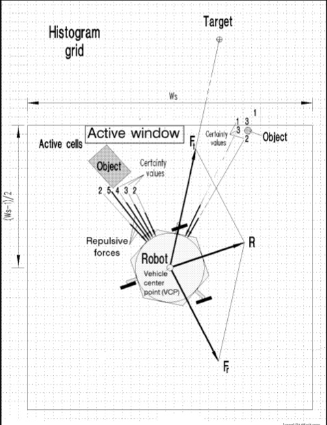

!SLIDE light-on-dark center preso-part

# __Potential Fields__

  
  
  <canvas id="stage" width="600" height="272" />

.notes You can view one of the forms of oscillation common to potential fields here.

!SLIDE tidbits longtext small smbullets incremental full-page

## Basic Implementation and Origin of Potential Fields

* _Basic Implementation:_ Virtual Force Field Method(VFF)  
    * [1989 - Hogan  and Khatib]
* _Premise:_ There are imaginary forces that act upon the robot: 
  - Obstacles exert repulsive forces on the robot
  - Target applies an attractive force on the robot
* Becamse popular becase of its simplicity and elegance. 
* Designed for real-time obstacle avoidance. Allows fast, continuous, and "smooth" motion.
* [1985'-86' Krogh and Thrope] - Suggest a method for using generalized potential fields for local path planning

!SLIDE histogram full-page

.notes - Each grid cell has certainty values(costmap) for obstacles and they exert repulsive forces
- There is an attractive Force pulling the robot towards the target
- And there is a resultant force R

!SLIDE light-on-dark center

# _Simple Enough..._