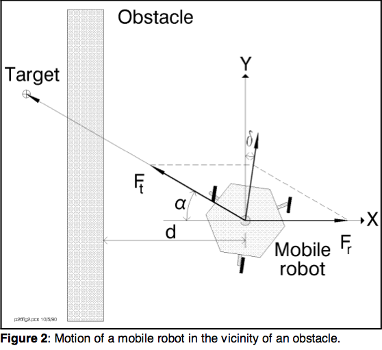
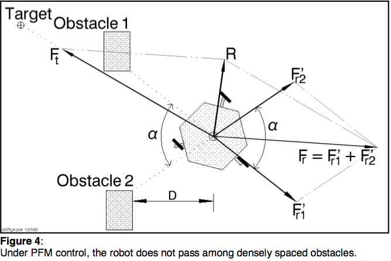
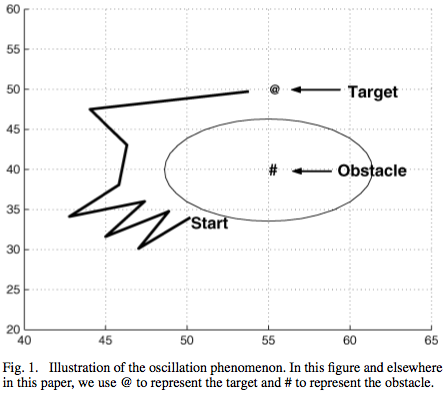
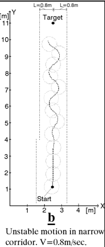

!SLIDE pfields-problems longtext center

# But there are **inherit** problems with it!

### These problems and cases are brought up in the "Potential Field Methods and Their Inherit Limitations..." paper by Y. Koren and J. Borenstein

#### which we will now examine....

!SLIDE pfields-problem1 center

## Local minima 

!SLIDE pfields-problem2 center

## No passage

!SLIDE pfields-problem3 center

## Oscillations around obstacles

!SLIDE pfields-problem4 center

## Oscillations in narrow corridors

!SLIDE

# However not all is lost...