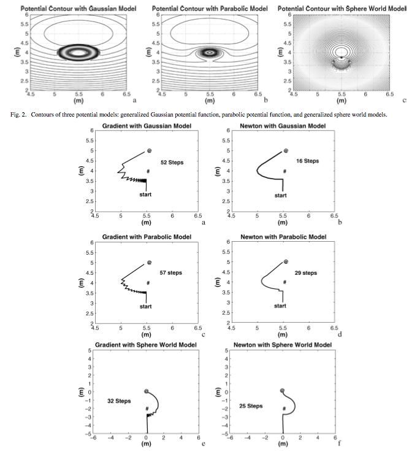

!SLIDE pfields-solutions

# Proposed solution for __oscillations__

* Modified Newton's Method Applied to Potential Field-Based Navigation for Mobile Robots (Jing Ren, Kenneth McIssac, and Rajini V. Patel) [2006]

!SLIDE full-page center

.notes - No interest or time to explain this, but thought I would briefly mention
- Here are several examples of how they improved oscillations using different methods taken from optimization theory.
- Point out that this solves oscillations, but not other two problems. 
- Obviously more complex, and only works for low dimensionality
- These “optimizations” only work for low dimensional, computational cost is prohibitive for higher dimensionality path planning.
- Suggestion that it will still work for offline path planning for predefined paths.
- Another example: evolutionary genetic potential field algorithm to avoid local minima situation. Forsee minima situations and avoid them. Performance sucks.
